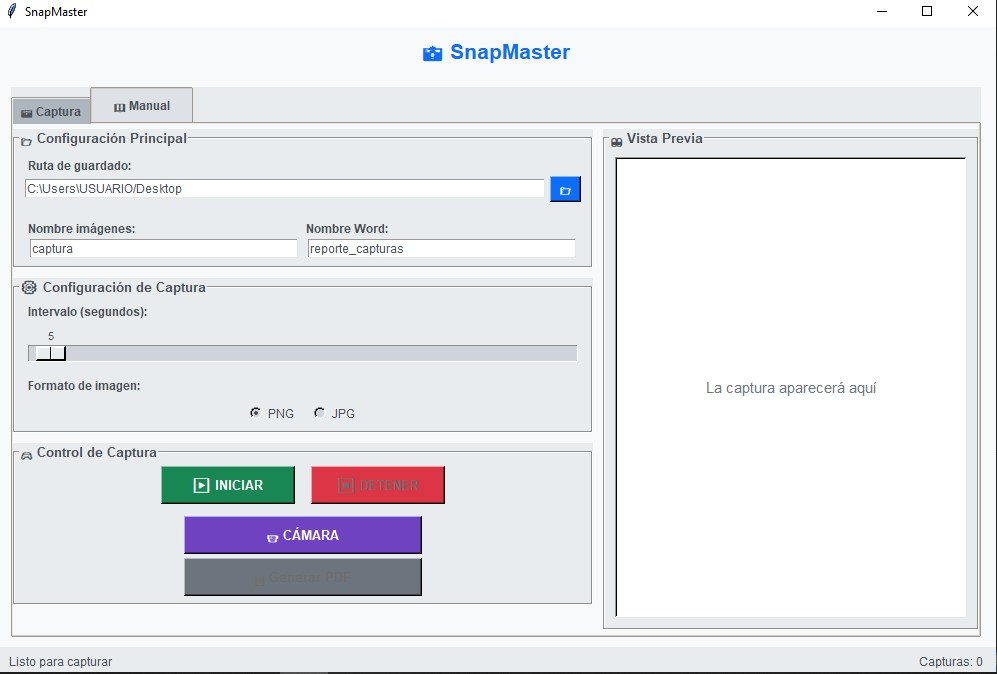

# 📸 SnapMaster Profesional

Aplicación profesional en **Python** para capturas de pantalla, grabación con webcam, generación de reportes en **Word** y exportación a **PDF**.  
Ideal para estudiantes, profesionales y empresas que necesitan documentación visual rápida.

---

## 🚀 Funcionalidades

✅ Capturas de pantalla manuales y automáticas.  
✅ Vista previa en tiempo real de las capturas.  
✅ Integración con **webcam**.  
✅ Generación de reportes en **Word**.  
✅ Conversión a **PDF** automática (Windows, LibreOffice o docx2pdf).  
✅ Interfaz moderna con **pestañas y secciones claras**.  
✅ Seguridad: **Login y contraseña encriptada**.  

---

## 🖼️ Vista previa




> 📂 Guarda tus capturas en la carpeta `assets/` y ajusta los nombres en este README.  

---

## 📦 Instalación

Clona el repositorio e instala las dependencias:

```bash
git clone https://github.com/TUUSUARIO/snapmaster.git
cd snapmaster
pip install -r requirements.txt
